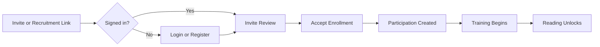
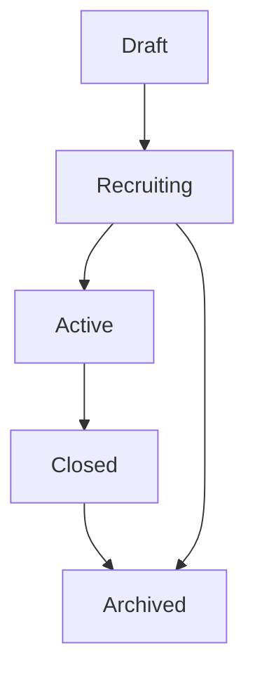
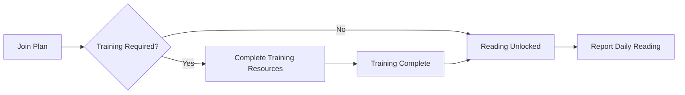
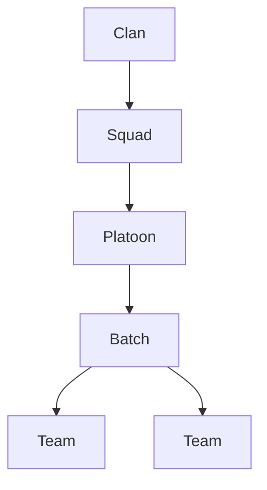
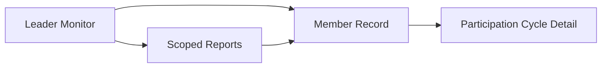
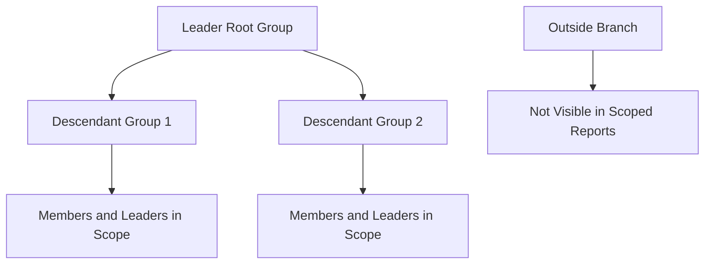
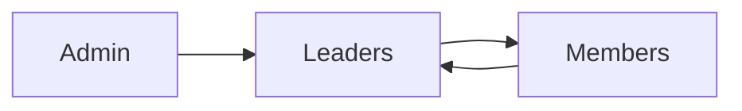

# Bible Reading Tracker User Manual

This manual introduces the Bible Reading Tracker for admins, leaders, and members. It is written as a single reference guide so it can later be split into role-based mini guides.

## Access Note

The manual is meant to be accessible to every authenticated user inside the app. In-app sections should be exposed according to the user’s role and hierarchy scope:

- all users can open the manual entry point
- leaders should see leader-specific sections for their branch responsibilities
- admin-surface users should see the operational and hierarchy-management sections

## 1. System Purpose

The Bible Reading Tracker helps teams move people from onboarding and training into steady daily reading, leader care, and accountable follow-up. The platform combines:

- reading-plan lifecycle management
- member enrollment and invite flows
- training and reading progression
- hierarchy-based visibility and leadership oversight
- messaging, notifications, and automation
- participation history and reporting

## 2. Roles

### Admins

Admins manage global setup, reading plans, hierarchy structure, reporting, operational workflows, system access, and audit visibility.

### Leaders

Leaders oversee the people inside their assigned hierarchy branch. They can monitor pace, reassign members within their scope, open detailed records, and drill into participation cycles.

### Members

Members enroll in reading plans, complete training where required, report daily reading, review their own history, receive messages, and follow plan guidance.

## 3. Enrollment Paths

Members can join through three main paths:

1. Public invite links sent by leaders or admins.
2. Registration-first enrollment from a shared invite entry point.
3. Direct joining from active public recruitments inside the app.

## 4. Plan Creation And Lifecycle Management

Admins create reading plans from the admin dashboard. Each plan includes:

- plan type
- lifecycle status
- schedule settings
- enrollment window
- optional training resources
- public invite links

Lifecycle guidance:

1. `Draft`: internal planning only.
2. `Recruiting`: visible for enrollment.
3. `Active`: reading is underway.
4. `Closed`: no new participation.
5. `Archived`: historical reference only.

## 5. Training Workflow

Some plans include prerequisite training resources. Leaders can see who is still in training and who is ready to start reading.

Expected sequence:

1. Join the plan.
2. Complete all assigned training resources.
3. Wait for the reading start date or reading unlock.
4. Begin daily reading and progress reporting.

## 6. Daily Reading Workflow

Members open their reading progress page, see the expected day, and mark the assigned reading complete. Leaders then see the updated pace in monitoring and reporting views.

Daily rhythm:

1. Open the active plan.
2. View today’s reading assignment.
3. Mark the reading complete.
4. Review streak, completion, and history.

## 7. Catch-Up And Read-Ahead Workflow

The tracker distinguishes between:

- `Catching Up`: expected readings remain incomplete.
- `On Track`: expected readings are complete.
- `Reading Ahead`: readings beyond the expected day have been reported.
- `Awaiting Start`: reading is not yet unlocked.
- `In Training`: required training is incomplete.

Leaders can filter by these pace states from both the monitor view and scoped reporting.

## 8. Hierarchy Management Workflow

Admins manage the leadership hierarchy from the hierarchy manager. Key workflows include:

1. Create groups and assign matching leaders.
2. Promote into vacant leadership slots.
3. Demote leaders safely into member assignments.
4. Review balance insights for sibling teams.
5. Run guided horizontal migrations.
6. Run sibling merges with explicit leader disposition.

## 9. Guided Horizontal Migration Workflow

The migration workflow is designed for same-level movement only.

Steps:

1. Select the source group.
2. Select a destination parent at the same level as the current parent.
3. Review the path changes, impacted leaders, descendant groups, and members.
4. Confirm the move.

This workflow does not allow vertical restructuring.

## 10. True Sibling Merge Workflow

The merge workflow combines two sibling groups of the same type.

Steps:

1. Select the source group to retire.
2. Select the target group that will survive.
3. Review the members and descendants that will move.
4. Choose the merged leadership assignment.
5. Explicitly decide where any outgoing leaders should land.
6. Confirm the merge and delete the emptied source group.

## 11. Leader Monitoring And Reporting Workflow

Leaders use the hierarchy monitor to:

- filter by member name, group, and pace
- reassign members inside their permitted team scope
- open richer member detail pages
- drill into participation-cycle history
- jump into scoped progress reports where access is enabled

## 12. Hierarchy Visibility And Reporting Scope

Reporting follows branch boundaries.

- admins can access global reporting
- leaders can access their own branch
- users outside the branch are excluded from scoped reporting and leader drilldowns

## 13. Messaging Workflow

The message center supports inbox and sent views, compose flows, plan-aware audience selection, and scoped delivery for leaders and admins.

Message directions:

- admins can coordinate across broader operational contexts
- leaders communicate down their branch
- members can respond upward through supported flows

## 14. Notifications And Automation Workflow

Automation can alert users and leaders about plan activity, reminders, and operational actions. Notifications appear in the in-app center and may also respect delivery preferences where configured.

Admins can:

- review automation settings
- run automation manually
- inspect resulting notifications and audit entries

## 15. Participation History Workflow

Each participation cycle tracks:

- start date
- end date, where applicable
- participation number
- join source
- status
- linked reading progress

Leader record pages show cycle-by-cycle history and allow direct drilldown into a single participation’s progress log.

## 16. Troubleshooting

### A leader cannot see their branch

Check that:

- the user has a leader role
- their `hierarchy_id` matches the leadership type
- the hierarchy record points to them as the leader where expected

### A member is stuck in training

Check that:

- training resources exist for the active plan
- the member completed all required training items
- the reading start date has passed

### A leader cannot open scoped reports

Check that:

- the user has the required reporting permission
- the user can access the admin area

### A merge or migration cannot be confirmed

Check that:

- the destination remains at the same valid level
- the source and target are true siblings for a merge
- outgoing leader disposition has been selected when required

## 17. FAQ

### Can a branch be moved higher or lower in the hierarchy?

No. The guided migration workflow is intentionally limited to horizontal movement.

### What happens to the source group after a merge?

The source group is deleted after its members and descendants are moved into the target group.

### Can leaders see participation history?

Yes. Leaders can open member records and drill into participation cycles for people inside their branch.
